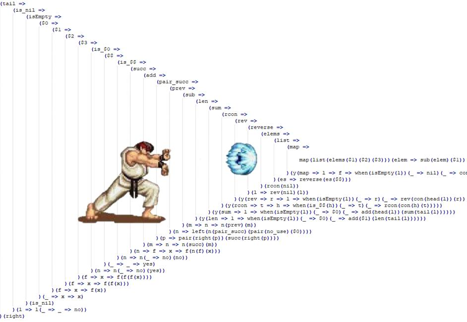

// :author: Deon Tan
:customcss: dt-theme.css
:source-highlighter: highlightjs
[.carwow.background]
= Callback Hell

[.carwow.background]
== A typical JS project

[.carwow.background]
== help!
image::die.png[]
There must be another way!

[.carwow.background]
== Toy example:

[source, javascript]
----
const _genLongString = (url) => {
  // simulate a giant payload
  let chars = [];
  const bigNum = Math.floor(Math.random() * 1000000 + 1000000);
  for (let i = 0; i <= bigNum; i += 1) { chars.push('x'); }
  const longString = chars.join('');
  return longString;
};
----

[.carwow.background]
== Toy example:

[source, javascript]
----
const fetchData = (url, callback) => {
  setTimeout(() => {
    console.log('fetching data from ' + url + '...');
    const longString = _genLongString(url);
    callback(longString);
  } , 1000);
};
----

[.carwow.background]
== Toy example:

[source, javascript]
----
const getSize = (data, callback) => {
  // this could be an external service
  setTimeout(() => {
    console.log('calculating size of data...');
    callback(data.length);
  }, 1000);
};
----

[.carwow.background]
== Toy example:

[source, javascript]
----
const intoMBs = (size, callback) => {
  // a slow async calculation
  setTimeout(() => {
    const sizeInMBs = size / 1024;
    callback(sizeInMBs);
  }, 1000);
};
----

[.carwow.background]
== Toy example:

[source, javascript]
----
const postResult = (sizeInMBs) => {
  setTimeout(() => { console.log('posting result: ' + sizeInMBs + 'MBs')}, 1000);
};
----

[.carwow.background]
== Example One:
Callback Hell style:

[source, javascript]
----
// ⬇️
fetchData('wat.js', (data) => {
  // ↘️
  getSize(data, (size) => {
    // ➡️ 
    intoMBs(size, (sizeInMBs) => {
      // ✊✊✊
      // Hadouken!
      postResult(sizeInMBs);
    });
  });
});
----

[.carwow.background]
== Example Two:
Promises:

[source, javascript]
----
const promisify = (f) => (arg) => {
  return new Promise((resolveCallback, reject) => {
    f(arg, resolveCallback);
  });
};
----

[.carwow.background]
== Example Two:

[source, javascript]
----
const getLargeExternalDataP = promisify(getLargeExternalData);
const getSizeP = promisify(getSize);
const intoMBsP = promisify(intoMBs);
const postResultP = promisify(postResult);

getLargeExternalDataP('wat.promise')
  .then((data) => getSizeP(data))
  .then((size) => intoMBsP(size))
  .then((sizeInMBs) => postResultP(sizeInMBs));
----

[.carwow.background]
== Example Two:
[source, elm]
----
-- Maybe.andThen : (a -> Maybe b) -> Maybe a -> Maybe b
parseMonth : String -> Maybe Int
parseMonth userInput =
    String.toInt userInput
      |> andThen toValidMonth

toValidMonth : Int -> Maybe Int
toValidMonth month =
    if 1 <= month && month <= 12 then
        Just month
    else
        Nothing
----
[.carwow.background]
== Example Three:
Async Await:

.defending against the dark arts with magic

[.carwow.background]
== Example Three:
Async Await:

// not even the luck of Harry Potter
// or a sorting hat
// will help you debug async/await bugs
[source, javascript]
----
async function doAsync() {
  // pray you don't forget to which functions need await
  const data = await getLargeExternalDataP();
  const size = await getSizeP(data);
  const sizeInMBs = await intoMBsP(size);
  await postResultP(sizeInMBs);
}
doAsync();
----

[.carwow.background]
== Example Four:
Continuation Passing Style (CPS)

Use Functional Programming in place of magic

[source, javascript]
----

const getLargeExternalData = (url, retn) => {
  // var x = ...
  retn(x);
};

const getSize = (data, retn) => {
  // var x = ...
  retn(x);
};

const intoMBs = (size, retn) => {
  // var x = ...
  retn(x);
};

----

[.carwow.background]
== Example Four:
Continuation Passing Style (CPS)

If you squint that conventional callback is a lot like the explicit
block parameter you can use in ruby methods

[source, ruby]
----

def get_large_external_data(url, &retn)
  # x = ...
  retn.call(x)
end

def get_size(data, &retn)
  // var x = ...
  retn.call(x)
end

def into_mbs(size, &retn)
  // x = ...
  retn.call(x)
end

get_large_external_data('foo') do |data|
  get_size(data) do |size|
    into_mbs(size) do |mbs|
      puts(mbs)
    end
  end
end
----
[.carwow.background]
== Example Four:
Continuation Passing Style (CPS)

Methods actually all support implicit blocks via yield

Did Matz have continuations in mind when he added this feature? 🤔

[source, ruby]
----

def get_large_external_data(url)
  # x = ...
  yield(x)
end

def get_size(data)
  // var x = ...
  yield(x)
end

def into_mbs(size)
  // x = ...
  yield(x)
end

get_large_external_data('foo') do |data|
  get_size(data) do |size|
    into_mbs(size) do |mbs|
      puts(mbs)
    end
  end
end

def do_cps(input, methods)
  result = input
  capture = Proc.new {|x| result = x}
  methods.each do |m|
    method(m).call(result, &capture)
  end
  result
end

do_cps('foo', [
  :get_large_external_data,
  :get_size,
  :into_mbs
])

# Ruby is 'helpful' and blurs the lines between zero-arg methods and inline values
# this means you can't use methods as first class objects, the interpreter will
# try to evaluate the method by invoking it with zero args so have to use
# indirection
# values vs thunks is a bit Haskelly if you squint
----

[.carwow.background]
== Example Four:
Continuation Passing Style (CPS)

[source, javascript]
----
const doCPS = (initialInput, fs) => {
  const iter = (arg, gs) => {
    const [g, ...rest] = gs;
    if (gs.length > 0) {
      // recurring step
      return g(arg, (returnedValue) => iter(returnedValue, rest));
    } else {
      // termination step
      return g(arg, (finalValue) => console.log(finalValue));
    }
  }
  return iter(initialInput, fs);
};
----

[source, javascript]
----
doCPS('cps-ftw.js', [
  getLargeExternalData,
  getSize,
  intoMBs,
  postResult,
]);
----
